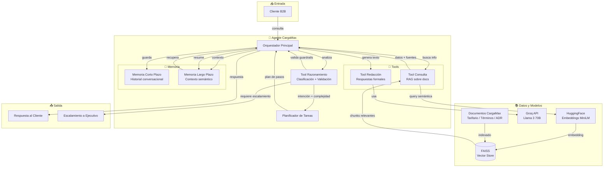
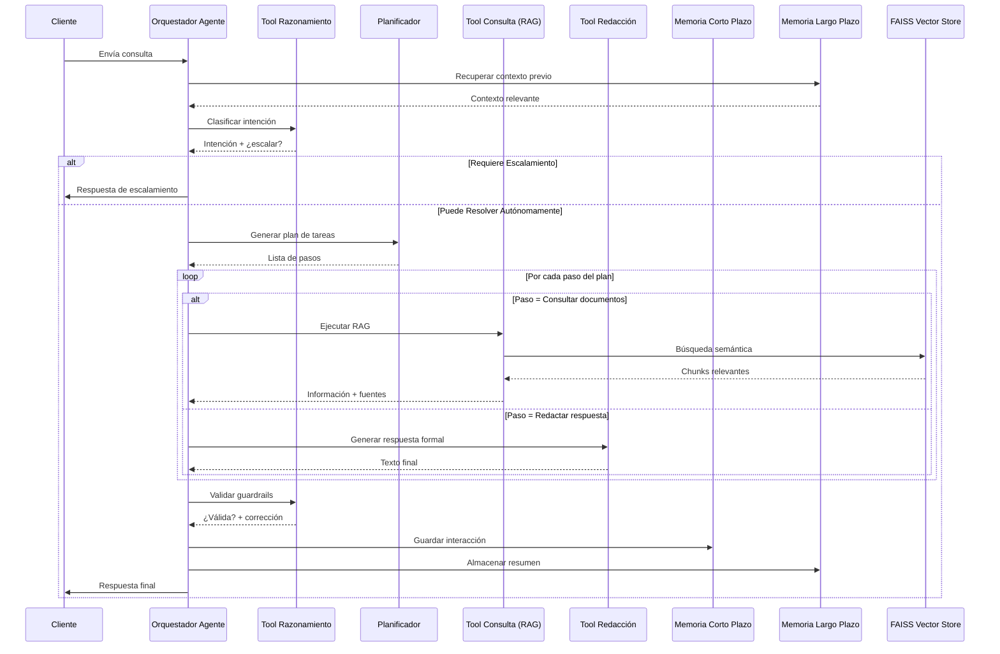
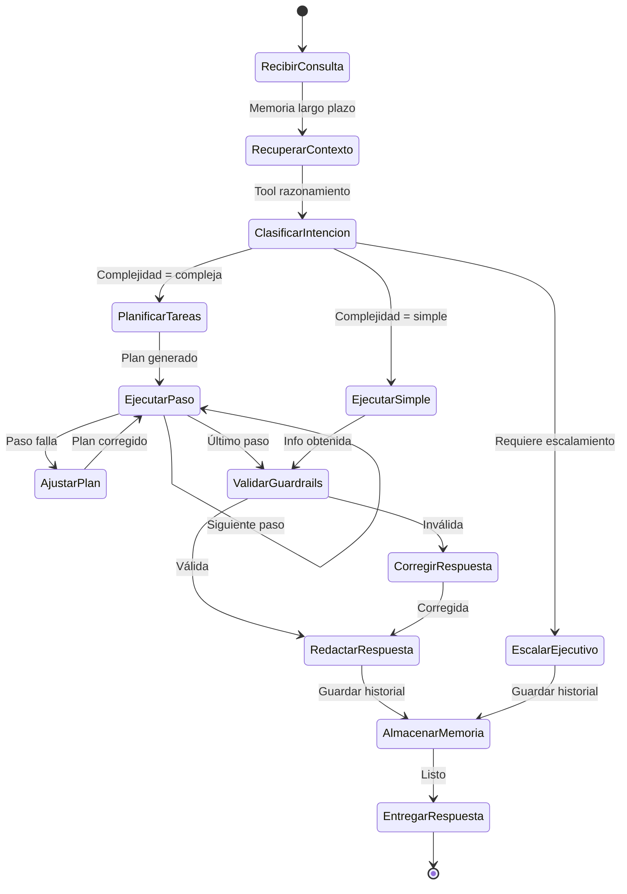

# Diagrama de Arquitectura del Agente CargaMax

## Vista General de Componentes

## Flujo de Trabajo del Agente (Secuencia)

## Diagrama de Estados del Agente

## Relación entre Componentes y Flujo de Trabajo

| Componente | Rol en el flujo de trabajo automatizado |
|-----------|------------------------------------------|
| **Orquestador** | Recibe la consulta, coordina la secuencia de tools y memoria, y entrega la respuesta final. Es el cerebro del flujo. |
| **Tool Razonamiento** | Filtra y clasifica antes de actuar. Decide si el agente puede resolver solo o si debe escalarse. Reduce riesgo operacional. |
| **Planificador** | Permite que el agente no se 'pierda' ante consultas complejas. Divide el problema en pasos manejables, como haría un operador humano. |
| **Tool Consulta (RAG)** | Garantiza que las respuestas se basen en documentos reales de CargaMax, no en conocimiento genérico del LLM. Mitiga alucinaciones. |
| **Tool Redacción** | Estandariza el tono y formato de las respuestas, manteniendo la imagen institucional sin depender de la variabilidad del LLM. |
| **Memoria Corto Plazo** | Mantiene coherencia dentro de una misma conversación. Permite preguntas de seguimiento como "¿y con express?" sin repetir contexto. |
| **Memoria Largo Plazo** | Personaliza la atención entre sesiones. Un cliente recurrente no debe repetir sus preferencias cada vez que contacta. |
| **FAISS** | Almacena tanto el corpus documental (RAG) como los resúmenes de memoria. Unifica la infraestructura de recuperación semántica localmente sin dependencias de servicios cloud. |
| **Groq (LLM)** | Provee la capacidad de lenguaje para todas las tools: entender consultas, generar texto, razonar sobre decisiones. |

